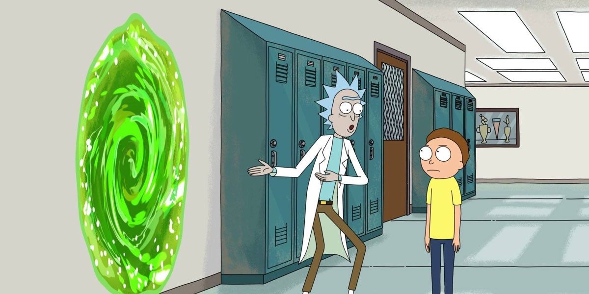

+++
title = "monologue trees: the story thus far"

description = "Where we start a blog instead of developing a game"

draft = false

taxonomies.categories = [
    "trees",
]

taxonomies.tags = [
    "rust",
    "bevy",
    "editor",
]

date = "2023-09-17"

authors = [
  "Elijah Voigt",
]
+++

So in August of 2021 my friend Sam sat me down at [Lardo][lardo] and pitched me the idea of Monologue Trees.
The gist was this:

* A first-person perspective game where you sat overlooking a lake and a forest.
* From time to time a tree would prompt you to click it.
* A dialog box would pop up above the tree with some profound thought.

We had talked about making games before, but always "big" games that would take a studio, fair enough two part time friends, months to ship.
I was excited to finally collaborate and this idea was *so* simple I couldn't imagine this taking more than a few months.
It was August, so if we put our heads to it we could ship something by... end of year?
So simple.
So easy.

That was uhh... over 2 years ago.

In that time we've had versions of the game that were varying levels of "alpha release", but never anything near ready to publish.

## So what happened?

Neither Sam nor I had ever made a videogame so there have been a lot of hard mistakes made.

Of course I have plenty of excuses...
* not enough time with my day job
* lack of inspiration
* depressive episodes
* raising a newborn

But there are a few "real" snags that would have gotten this done much faster.

### Aversion to "ugly" details

I have started over, re-writing the game multiple times, because "it just got out of hand".
This is a blessing and a curse.
I have gained a lot of muscle memory around some parts of game development as a result of burning what I had and starting over.
But there are more constructive ways to get that practice.
Plus that wasn't really my _intention_ so it feels wrong to claim that benefit.

It's like if I threw away a painting every time the perspective was off or the colors were wrong.
Sure I'm getting better at some parts of painting, but I have no experience in finishing, varnishing, framing, finding a space to show it, selling it -- you get the idea.

The final game will have ugly code, janky 3D models, and it will probably run like shit.
But it will be done and I will have learned way more lessons than I have starting over and over.

### Scope creep

Even with a simple design, I couldn't help myself and I tried from day 1 to make the game with procedurally generated levels.

This was an awful idea for a couple of reasons.
While procedural levels are a great way to stretch assets out into a larger game, it is a horrible way to start development you have no template to compare against.
Tuning the procedural generation is difficult when you don't have example "good levels" to base your tuning on.

Of course I justified this to myself by saying that procedural generation makes it more of a "game" than just a scripted interactive experience.
Unfortunately the difficulty cliff of getting _good_ procedural generation implemented means I would _never_ ship that without _first_ making a great scripted experience.

### Too many points into shiny

I have a little story I tell when making technical decisions with a team:

> Imagine you are building a Dungeons and Dragons character.
  You have 6 points you can allocate to stats like "On Time", "Robust", and "Shiny".
  If you put all your points into Shiny, you will never ship.
  If you put 3 points into Shiny, 2 into On Time, and 1 into Robust you will ship a bad product late.
  **Most projects only have enough budget for 1 shiny** if they want to deliver a good product anywhere near a deadline.

*Authors note: the specific stats and number of points don't matter.*

For me that shiny was [Bevy][bevy].
I have been a fan of the Rust Programming Language since 2014 and was excited to kick the tires on _another_ game engine after learning [Amethyst][amethyst] in 2020.

A more established game engine would have been Unity, Unreal, or Godot, but I tried for about a year to write the game in Bevy -- a very alpha engine.
This did not go well.

Bevy early on was _the best Rust Game Engine_ but that is a very low bar it had to step over.
Bevy was buggy, missing features, and I had never used a game engine before so I wasn't even sure how to use the features it had which worked.

Later on I tried to start over in [Godot][godot] 3, hoping to ship _something_ then go back to Bevy after having a win.
I gave up on Godot as well, not because it was a bad engine but because I was not inspired by working with it.
Using Godot felt like a grind when what I _really_ wanted was to be using Rust and gaining _that_ skill instead.
Specifically, using GDScript was so painful compared to what I knew programming was like with Rust.

*Authors note: I know there are projects to provide Rust bindings to Godot.*
*I chose not to use these tools for now, but will re-consider my position someday.*

## What did I learn?

Of course I learned a lot over the last 2 years.
I learned a dozen ways _not_ to ship a game and those are valuable lessons.
They are painful and frustrating, but valuable all the same.

Ultimately I felt uninspired using Godot and went back to Bevy, but I learned a lot about engine features from Godot.
I suggest all Bevy users make a Hello World game in Godot to understand what Bevy is trying to do.

Don't add _any_ bells and whistles until you have the core of an idea prototyped and playable.

Adding features like procedural generation was fun but never worked:
* Getting a hand crafted level complete would have done tons to boost my confidence.
* Then templating that into 4 hard-coded levels would have given us a solid game experience.
* _Then_ we could generalize the solution into a procedural generated experience if it added to the thesis of the game.

## So what's the plan?

This is my... 5th time re-starting development.

The focus now is to get a useable editor in place so Sam can iterate on ideas and build out levels by hand.
Once we're able to work in parallel I can continue improving the engine while levels get made, play-tested, and iterated on.

I've already got most of an editor in place, it's just missing some features that I _hope_ will make it 10x more useful.
I'll leave details about that editor for my next update.

Thank you for reading and happy hacking!

[lardo]: https://www.lardosandwiches.com/
[bevy]: https://bevyengine.org
[amethyst]: https://amethyst.rs/
[godot]: https://godotengine.org/
